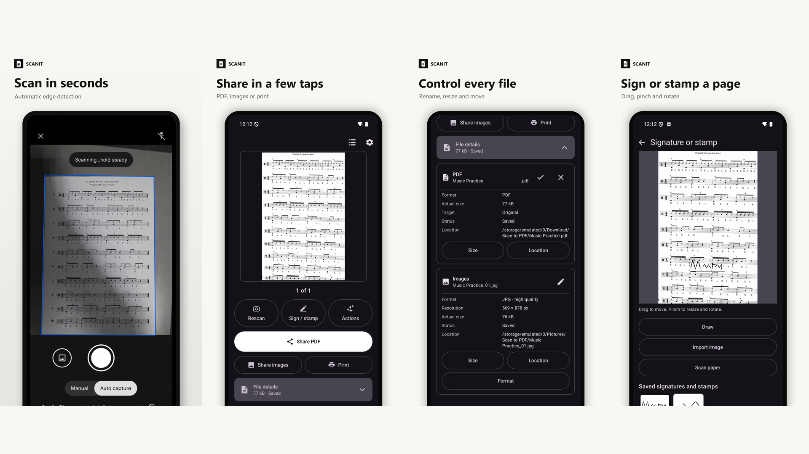
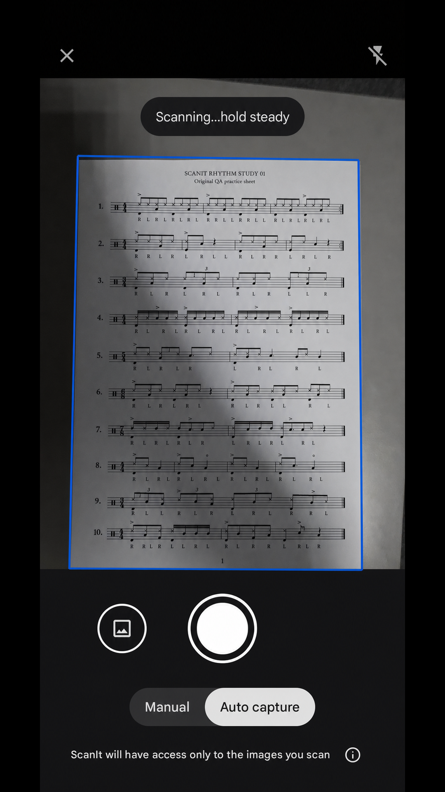
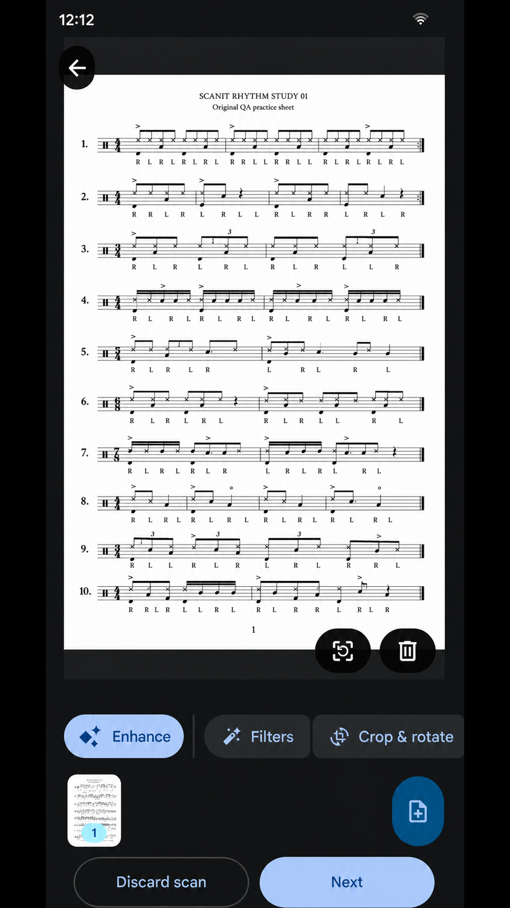
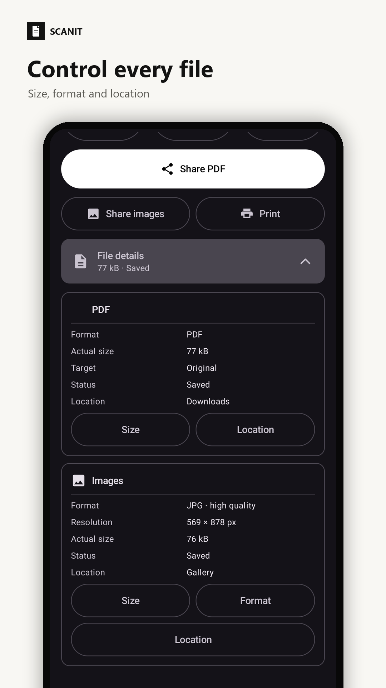
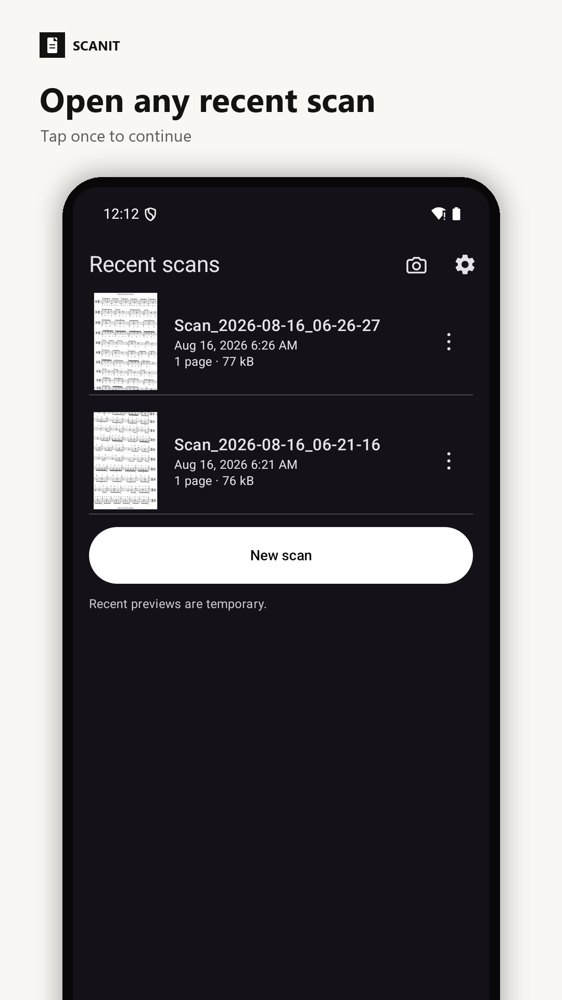
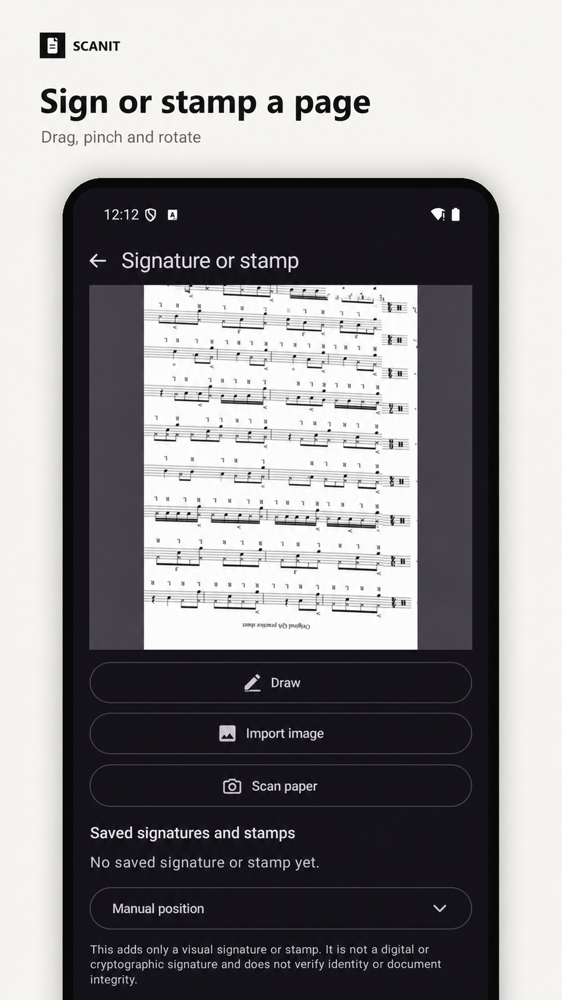
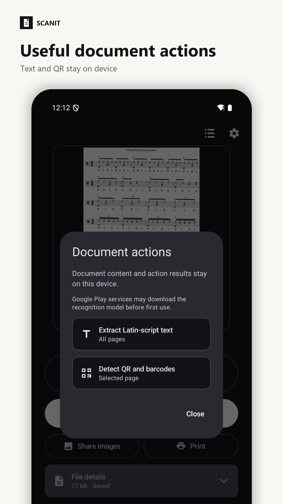
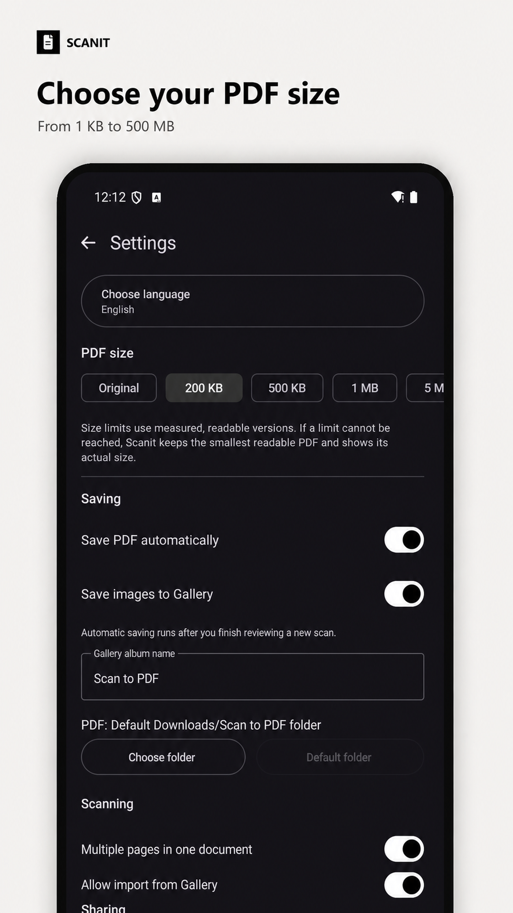
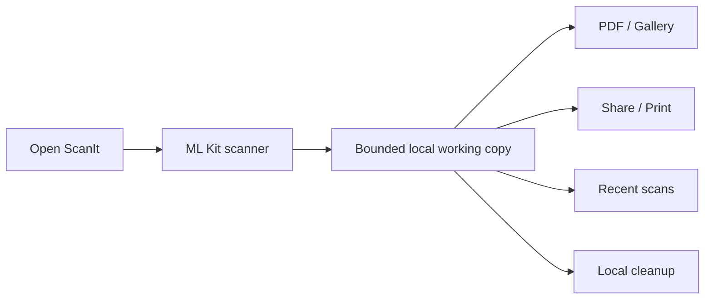

<h1 align="center">ScanIt</h1>

<p align="center">
  <strong>Scan → save → share.</strong><br>
  A deliberately simple Android document scanner for people who do not want to manage files.
</p>

<p align="center">
  <a href="https://github.com/Majkey25/ScanIt/actions/workflows/android-ci.yml"></a>
  <a href="https://github.com/Majkey25/ScanIt/releases/latest"></a>
  
  <a href="LICENSE"></a>
</p>

<p align="center">
  <a href="https://github.com/Majkey25/ScanIt/releases/tag/v1.5.0"></a>
</p>

## v1.5.0 update

Manual redaction now defaults to a professional straight-line tool and keeps the
freehand brush as an option. Both share adjustable thickness, undo, redo, clear,
and permanent rasterization into a protected child revision.

Document Actions now recognize Latin text, including Czech, or Chinese text.
Read all pages can use Auto, Czech, English, German, Spanish, or Chinese speech.
Settings are grouped into collapsible General, Saving, Scanning, Sharing, and
Advanced sections; action-language controls live under Advanced.

Manual redaction now works like a black marker: draw directly over text, adjust
the brush thickness, and use undo, redo, or clear. Applying the redaction burns
the black strokes into a protected child revision, so the covered pixels cannot
be moved or removed from that result.

The current stable release keeps the full Google scan editor with page previews,
crop and rotate, and Google's filter gallery, then continues directly to the
ScanIt Result and sharing actions. The redundant ScanIt intensity/shadow screen
has been removed. The APK also includes the Recent scans dashboard, reusable
visual signatures and stamps, measured and custom PDF size targets, and six
selectable language modes. Settings now include a localized Buy Me a Coffee
button; support remains optional and does not unlock features. Settings now save
after each change, survive navigation and updates, and default to deleting saved
PDFs after sharing while retaining saved images. Visual signatures and stamps
can be moved directly on a larger preview, resized and rotated with gestures, or
fine-tuned from the collapsed Manual position panel.
ScanIt now supports Android 13 and newer while keeping the same Google scanner,
sharing, saving, and verified cleanup behavior.

ScanIt now corrects page orientation from recognized line angles, with a portrait
fallback for textless landscape scans, before creating the result. Document Actions
also contain local Smart cleanup and Manual cleanup. Smart cleanup improves paper
contrast and removes likely edge fingers; Manual cleanup replaces user-drawn spots
with the surrounding paper color. Both create reversible child revisions.

The Result screen now keeps the document preview prominent and opens a
full-screen zoomable viewer when tapped. File details can change a document's
PDF name, size, and folder, and can change its image name, size, format, and folder. Image
exports support exact Original files, high-quality JPEG, and lossless PNG. A
Recent scan opens directly when tapped. The stable Actions panel extracts
Latin-script text from all pages, exports it through Android's file picker, or
detects QR codes and barcodes on the current page using on-device ML Kit models
delivered by Google Play services. The recognition model may download
before its first use; Actions report that state and can be retried afterward.

Result pages now swipe horizontally and reveal the edge of the next page.
Rescan, Sign / stamp, and Actions are compact accessible buttons, while File details groups
PDF and image changes into compact Size, Format, and Location controls.
Externally deleted PDF and image outputs are shown as Deleted and can be recreated
directly with Save without reusing stale provider locations.
After a full app restart, ScanIt opens a fresh scanner session instead of reopening
the previously viewed Result; completed scans remain available from Recent.

[Download ScanIt v1.5.0](https://github.com/Majkey25/ScanIt/releases/tag/v1.5.0)
or read the [full changelog](CHANGELOG.md).

<p align="center">
  
  
  
  
</p>

<p align="center">
  
  
  
  
</p>

[See all English and Czech screenshots](docs/play-store/assets/).

## Why ScanIt exists

Sending a scanned document should not require understanding folders, file
managers, or export dialogs. Open ScanIt and the scanner starts. Capture one or
more pages, check the result, then share the PDF or images through Android.

The interface is monochrome and follows the system language by default. English,
Czech, German, Spanish, and Simplified Chinese can also be selected from one
compact language picker in Settings.

ScanIt was built with AI-assisted coding and design. The maintainer reviews the
source, release artifacts, and real-device workflows.

## Features

- Opens Google ML Kit Document Scanner directly; no redundant landing-page tap.
- Automatic capture, edge detection, crop, rotation, filters, shadow removal, and cleanup through the ML Kit scanner flow.
- Single-page and multi-page PDF/JPEG output.
- Lazy page thumbnails for browsing multi-page results without decoding every page at once.
- Google's review editor provides page previews, crop and rotate, and Original, Auto, Color, Grayscale, Black and white, and Shadows filters before ScanIt creates the result.
- Automatic orientation correction from text-line angles, with a portrait fallback for textless landscape scans.
- Measured PDF size goals of Original, 200 KB, 500 KB, 1 MB, 5 MB, 10 MB, 20 MB, or a custom 1 KB–500 MB target; ScanIt reports the actual size when a readable result cannot meet the selected goal.
- Recent scans dashboard for up to eight bounded temporary working copies.
- Automatic PDF and Gallery saving, each configurable in Settings.
- Manual PDF, image, or combined saving from File details.
- Per-document PDF size and folder changes without changing saved defaults.
- Per-document image size, format, and folder changes with exact Original, high-quality JPEG, and lossless PNG export.
- Full-screen zoom and multipage browsing from the Result preview.
- On-device Latin-script text extraction across all pages, explicit text export, and selected-page QR/barcode detection with selectable results.
- Local Smart cleanup and lasso-based Manual cleanup with a preserved parent revision.
- Optional PDF destination selected with Android's Storage Access Framework.
- PDF/image sharing with configurable email subject and message.
- Optional exact deletion of saved PDFs or Gallery images from Recent scans or after a sharing app is chosen.
- Reusable drawn, imported, or scanned signatures and stamps, dragged directly into place on a selected page. These are image annotations, not digital or cryptographic signatures.
- Android system printing with page-range support.
- Monochrome light/dark UI with system, English, Czech, German, Spanish, and Simplified Chinese language selection.
- No ScanIt account, subscription, first-party analytics, advertising SDK, or cloud document library.
- No broad storage, camera, contacts, location, account, or notification permission requested by ScanIt.

## Install

Download the
[latest stable GitHub APK](https://github.com/Majkey25/ScanIt/releases/latest/download/app-github-release.apk).

Google Play services may download the scanner and recognition modules before
their first use. The public ScanIt app declares no app-owned Internet permission.

Requirements for the current public code:

- Android 13 or newer (`minSdk 33`, `targetSdk 36`).
- At least 1.7 GB total device RAM, required by ML Kit Document Scanner.
- Google Play services for the scanner module.
- A connection when Google Play services needs to download or update a scanner or recognition module.

## How it works



The scanner processes document content on-device. ScanIt keeps at most eight
temporary scan directories for Result and Recent scans. Android may clear these
working copies. PDFs saved to Downloads or a selected folder and images saved to
Gallery remain until the user deletes them.

## Privacy and security

- Ordinary scanning, OCR, barcode detection, redaction, and file creation remain on-device.
- Smart cleanup and Manual cleanup process document pixels locally and preserve the parent revision.
- Google Play services and ML Kit may process diagnostic and usage telemetry; scanned input remains on-device according to Google's ML Kit documentation.
- ScanIt does not send scanned content to a maintainer-operated server.
- File sharing uses scoped content URIs with read access granted to the selected receiving app.
- Saved-output changes are verified before activation and remove only the exact previously tracked output.
- Copied OCR and barcode results are marked as sensitive; detected payloads never open automatically.
- Android backup and device transfer are disabled for ScanIt app data.
- Sharing and printing hand a user-selected document to another app or service under that recipient's terms.

Read the [Privacy Policy source](docs/privacy.html),
[security policy](SECURITY.md), and [third-party notices](THIRD_PARTY_NOTICES.md).
The public policy deployment target is
`https://majkey25.github.io/ScanIt/privacy.html`.

## Build

JDK 17 and Android SDK 36 are required.

```powershell
.\gradlew.bat :app:testInternalDebugUnitTest :app:lintInternalDebug :app:assembleInternalDebug
.\gradlew.bat :app:lintGithubRelease :app:assembleGithubRelease
.\gradlew.bat :app:lintPlayRelease :app:bundlePlayRelease
```

The public distributions share the same app features:

| Distribution | Application ID | Artifact |
|---|---|---|
| Google Play | `com.majkeylab.scanit` | AAB |
| GitHub | `com.majkeylab.scanit.github` | APK |

The separate internal debug flavor is not a public release artifact. Release
signing reads an ignored local `keystore.properties` file; signing keys and
passwords must never enter Git.

## Technical choices

| Area | Choice |
|---|---|
| UI | One launcher, Jetpack Compose, Material 3 |
| Scanner | Google ML Kit Document Scanner |
| Storage | MediaStore, Storage Access Framework, bounded app cache |
| PDF | Bounded JPEG/bitonal writers + Android `PrintedPdfDocument` for printing |
| Sharing | Android Sharesheet + scoped `FileProvider` |
| Settings | `SharedPreferences` |

## Known limits

- Android decides which compatible apps appear in the Sharesheet.
- Recent scans are temporary working copies, not a permanent document library.
- A textless landscape page is assumed to be sideways and is rotated to portrait; use the Google review editor for a legitimate textless landscape document.
- Android 17 has no `maxSdk` restriction but has not yet been device-tested.
- Google Play publication is still in testing; do not describe the app as a production Play release yet.
- Visual marks do not verify identity, authorization, or document integrity.
- The repository does not contain production signing material.

## Feedback

Suggestions and reproducible bug reports are welcome through
[GitHub Issues](https://github.com/Majkey25/ScanIt/issues) or
[majkeylab@gmail.com](mailto:majkeylab@gmail.com). Never send private documents,
credentials, or device identifiers. Code pull requests are not currently
accepted; see [CONTRIBUTING.md](CONTRIBUTING.md).

## License

Current material is source-visible under the [ScanIt proprietary license](LICENSE),
not open source. Unmodified official binaries may be installed and used under
that license. Earlier copies distributed under MIT remain MIT-licensed; see
[Historical MIT releases](HISTORICAL_MIT_RELEASES.md).

## Support

ScanIt is free to use. If it saves you time, an optional tip helps fund future
maintenance. It does not unlock features or change support priority.

<p>
  <a href="https://www.buymeacoffee.com/majkey">Buy Me a Coffee</a><br>
  <a href="https://www.buymeacoffee.com/majkey"></a>
</p>
