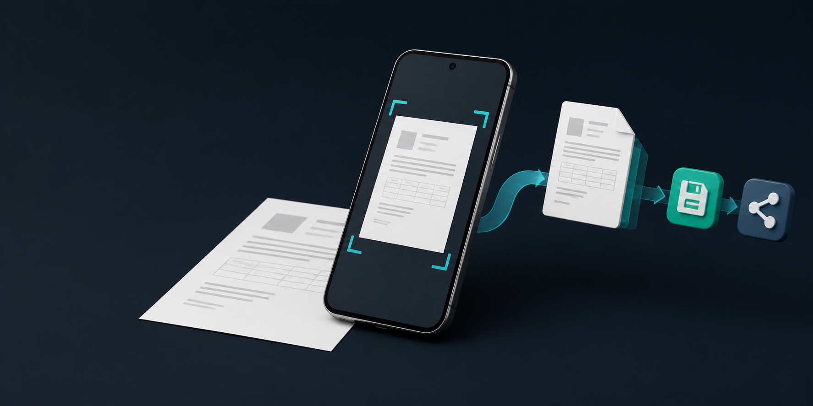
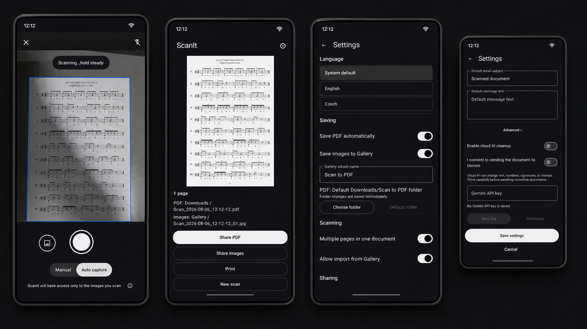
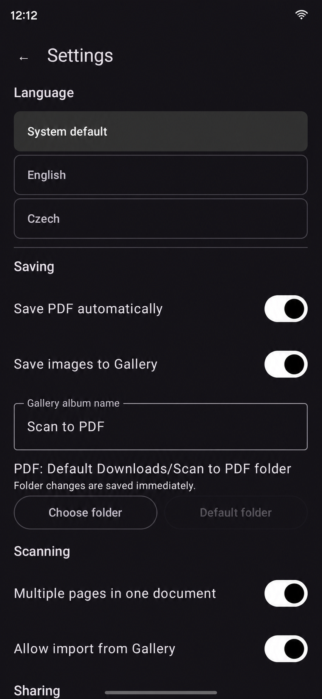
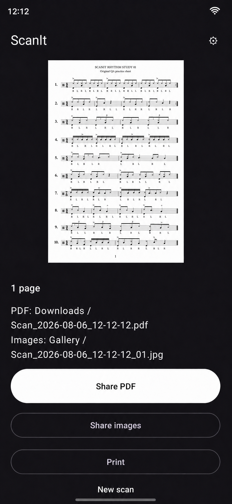
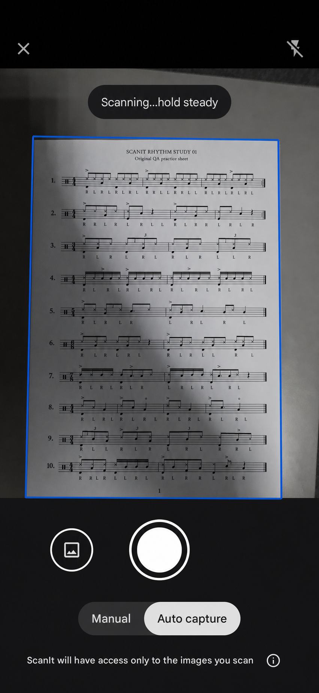
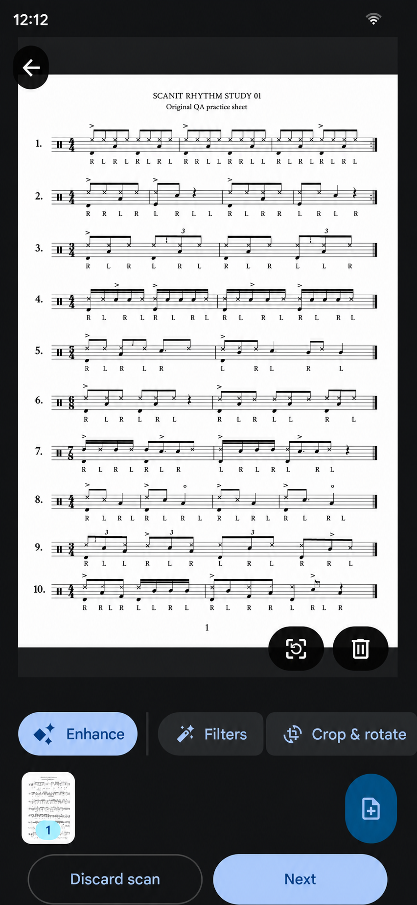
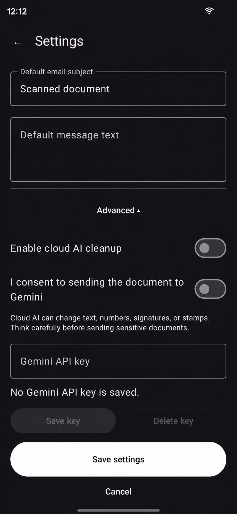
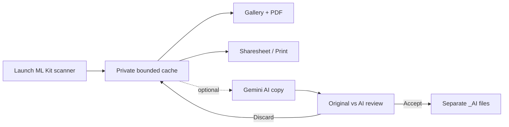

<p align="center">
  
</p>

<h1 align="center">ScanIt</h1>

<p align="center">
  <strong>Scan → save → send.</strong><br>
  A deliberately simple Android document scanner for people who do not want to manage files.
</p>

<p align="center">
  <a href="https://github.com/Majkey25/ScanIt/actions/workflows/android-ci.yml"></a>
  <a href="https://github.com/Majkey25/ScanIt/releases"></a>
  
  
  <a href="LICENSE"></a>
</p>

<p align="center">
  
</p>

## Why ScanIt exists

Sending a scanned document should not require understanding folders, file managers, or export dialogs. Opening ScanIt launches the scanner directly. After capture, the result is ready to share as a PDF or images through Android's system share sheet.

The monochrome interface follows the system language by default. English and Czech can also be selected in settings. Complete options stay behind the gear icon; experimental cloud AI stays under **Advanced** and is off by default.

ScanIt was built with AI-assisted coding and design. The source, builds, and real-device workflows were reviewed and tested by its maintainer.

## Interface

Presentation images are based on the tested device workflow and were refined with OpenAI ImageGen for presentation. They use an original generated QA rhythm sheet; status bars are standardized to 12:12 and stripped of device-identifying icons.

<p align="center">
  
  
</p>

<p align="center">
  
  
</p>

<p align="center">
  
</p>

## Features

- Direct launch into Google ML Kit Document Scanner; no redundant home-screen button.
- `SCANNER_MODE_FULL` for crop, perspective correction, rotation, filters, and document cleanup.
- Single-page or multi-page scans with JPEG and PDF output.
- JPEG pages saved to Gallery and PDFs saved to Downloads by default.
- Automatic PDF saving is on by default and can be disabled in settings; a temporary PDF remains available for sharing.
- Optional user-selected PDF folder through Android's Storage Access Framework.
- One-tap PDF/image sharing with attachment, subject, and message prepared.
- System printing with page-range support.
- Monochrome light/dark UI, system/English/Czech language selection, safe insets, and accessible touch targets.
- No account, first-party analytics, ads, user-visible history, database, or broad storage permission.
- Optional Gemini image cleanup with explicit consent, encrypted user-owned API key, immutable original, and before/after review.

## Install

1. Open the [v1.0.0 preview release](https://github.com/Majkey25/ScanIt/releases/tag/v1.0.0-preview.1).
2. Download `ScanIt-v1.0.0-preview.1.apk`.
3. Allow installation from the app used to download the file, then open the APK.

The preview APK is debug-signed and intended only for sideload testing. A future production-signed APK cannot update it in place: uninstalling this preview first will delete app-private settings, the API key, and temporary cache. Files already saved to Gallery, Downloads, or a selected folder remain. This is not the production-signed Google Play build.

Requirements:

- Android 15 or newer (`minSdk 35`, `targetSdk 36`)
- At least 1.7 GB total device RAM, required by ML Kit Document Scanner
- Google Play services for the scanner module
- Internet on first scanner use if Google Play services needs to download that module

## How it works



The original ML Kit scan is never overwritten. ScanIt retains at most eight temporary scan directories so an already-open mail draft does not immediately lose its attachment. It has no user-visible document history or document database.

<details>
<summary><strong>Advanced AI mode</strong></summary>

AI cleanup is experimental, optional, disabled by default, and has not been live-verified with a Gemini API key. The user must enable it, accept the cloud-transfer warning, and provide a key. Every page in the current scan is sent to Gemini sequentially. The key is encrypted with Android Keystore, and requests use the stable Interactions API with `store=false`.

Generated output can alter text, numbers, signatures, stamps, or layout. ScanIt therefore requires an explicit original/AI review before saving separate `_AI` files. A public Google Play release should replace the client-side key path with Firebase AI Logic plus App Check/Play Integrity or a backend.

</details>

## Privacy and security

- Local copies are saved to Gallery and Downloads by default; sharing, printing, and optional AI transfer require an explicit action.
- ScanIt includes no first-party analytics or advertising. Google Play services and ML Kit may collect diagnostic, usage, device, app, identifier, and API-configuration data described in [Google's ML Kit data disclosure](https://developers.google.com/ml-kit/android-data-disclosure).
- ScanIt does not send scanned content to its own server.
- FileProvider exposes only the bounded `cache/share/` directory and grants read access to selected files.
- No `CAMERA`, legacy storage, contacts, account, location, or notification permission is requested.
- Android backup and device transfer are disabled for app data.
- Gemini requests use explicit connect/read timeouts, do not follow redirects, and disconnect on cancellation.

Read the complete [privacy notes](PRIVACY.md) and [security policy](SECURITY.md).

## Build

JDK 17 and Android SDK 36 are required.

```bash
./gradlew clean :app:testDebugUnitTest :app:lintDebug :app:assembleDebug :app:bundleRelease
```

Windows users can run the checked helpers:

```powershell
.\tools\build.ps1
.\tools\verify-apk.ps1 .\app\build\outputs\apk\debug\app-debug.apk
```

| CLI tool | Purpose |
|---|---|
| `tools/build.ps1` | Runs the full local test, lint, APK, and AAB gate with JDK 17 validation. |
| `tools/verify-apk.ps1` | Prints manifest metadata, checks 16 KiB alignment/signature, and calculates SHA-256. |

GitHub Actions runs the same test/lint/build gate on every push to `main` and every pull request. Dependabot checks Gradle and Actions dependencies weekly.

## Technical choices

| Area | Choice |
|---|---|
| UI | One Activity, Jetpack Compose, Material 3 |
| Scanner | Google ML Kit Document Scanner |
| Storage | MediaStore, Storage Access Framework, bounded app cache |
| PDF | Android `PdfDocument` / `PrintedPdfDocument` |
| Sharing | Android Sharesheet + scoped `FileProvider` |
| Settings | `SharedPreferences` |
| Secret storage | AES-GCM key held by Android Keystore |
| Optional AI | Gemini Interactions API, `store=false` |

## Known limits

- Android decides which compatible apps appear in the Sharesheet; it cannot guarantee an email-only list while also reliably attaching the file.
- Android 17 has no `maxSdk` block and should remain installable, but it has not been device-tested yet.
- The experimental Gemini workflow has not been live-verified with an API key.
- Hard process termination during multi-file AI publication can leave an already-published `_AI` file; the immutable original remains safe.
- The repository does not contain a production signing key or Gemini API key.

## Feedback

Suggestions and reproducible bug reports are welcome through [GitHub Issues](https://github.com/Majkey25/ScanIt/issues) or at [majkeylab@gmail.com](mailto:majkeylab@gmail.com). Never send private documents, API keys, or other sensitive data.

## License

Released under the [MIT License](LICENSE).
