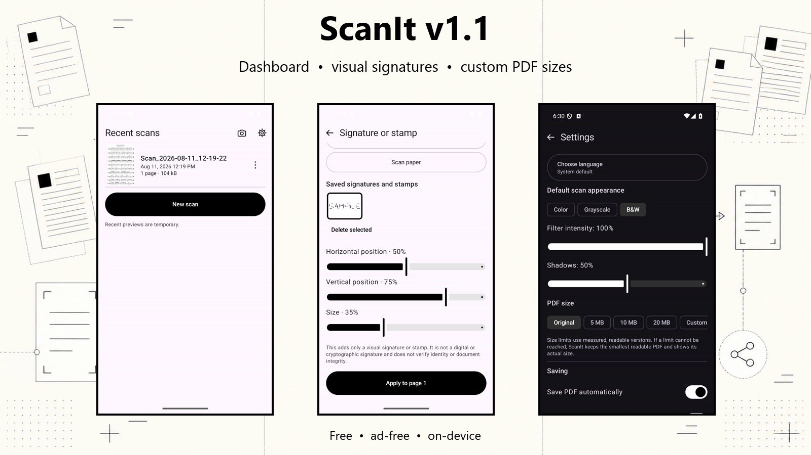
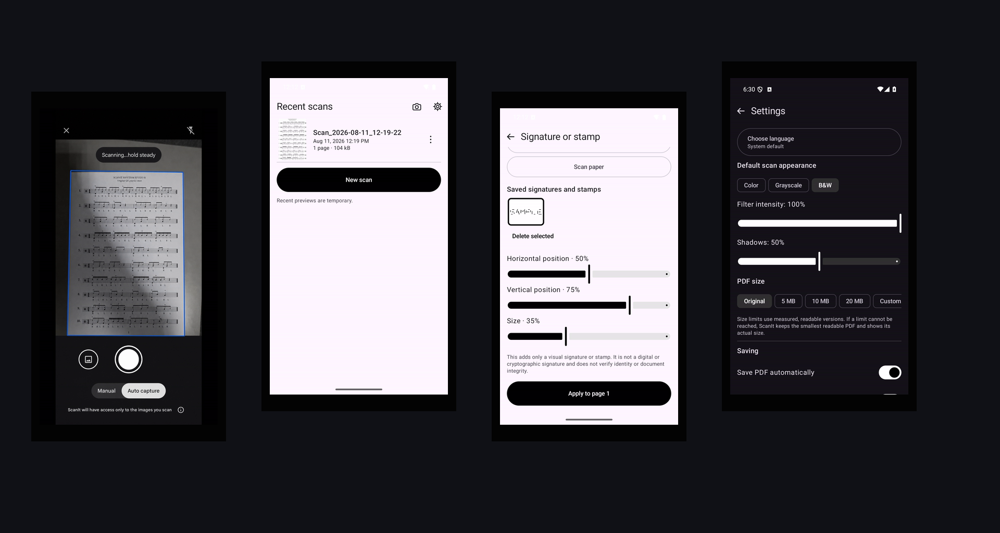
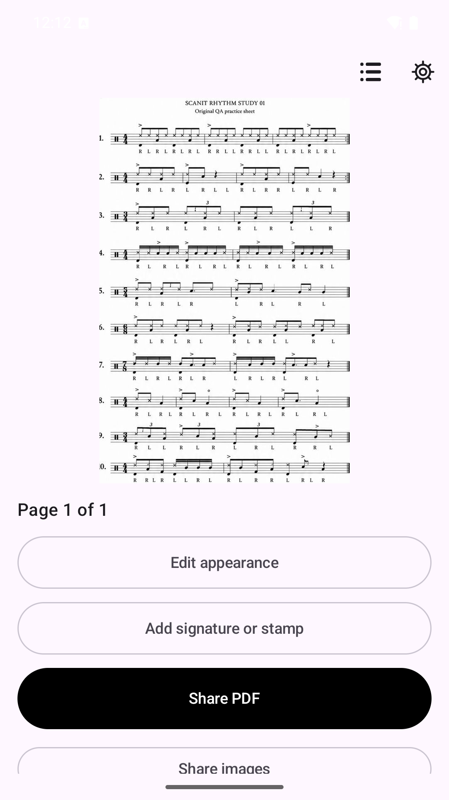
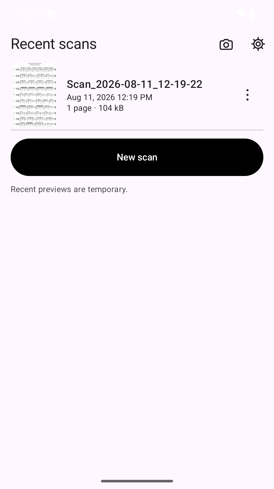
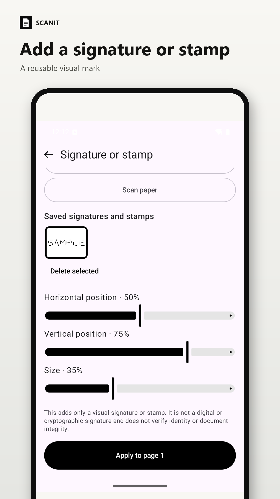
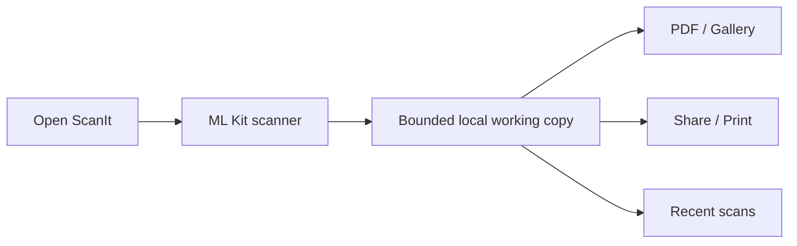

<h1 align="center">ScanIt</h1>

<p align="center">
  <strong>Scan → save → share.</strong><br>
  A deliberately simple Android document scanner for people who do not want to manage files.
</p>

<p align="center">
  <a href="https://github.com/Majkey25/ScanIt/actions/workflows/android-ci.yml"></a>
  <a href="https://github.com/Majkey25/ScanIt/releases/latest"></a>
  
  <a href="LICENSE"></a>
</p>

<p align="center">
  <a href="https://github.com/Majkey25/ScanIt/releases/tag/v1.2.1"></a>
</p>

## v1.2.1 update

The current stable release keeps the full Google scan editor with page previews,
crop and rotate, and Google's filter gallery, then continues directly to the
ScanIt Result and sharing actions. The redundant ScanIt intensity/shadow screen
has been removed. The APK also includes the Recent scans dashboard, reusable
visual signatures and stamps, measured and custom PDF size targets, and six
selectable language modes.

[Download ScanIt v1.2.1](https://github.com/Majkey25/ScanIt/releases/tag/v1.2.1)
or read the [full changelog](CHANGELOG.md).

<p align="center">
  
</p>

## Why ScanIt exists

Sending a scanned document should not require understanding folders, file
managers, or export dialogs. Open ScanIt and the scanner starts. Capture one or
more pages, check the result, then share the PDF or images through Android.

The interface is monochrome and follows the system language by default. English,
Czech, German, Spanish, and Simplified Chinese can also be selected from one
compact language picker in Settings.

ScanIt was built with AI-assisted coding and design. The maintainer reviews the
source, release artifacts, and real-device workflows.

<p align="center">
  
  
  
</p>

[See all English and Czech screenshots](docs/play-store/assets/).

## Features

- Opens Google ML Kit Document Scanner directly; no redundant landing-page tap.
- Automatic capture, edge detection, crop, rotation, filters, shadow removal, and cleanup through the ML Kit scanner flow.
- Single-page and multi-page PDF/JPEG output.
- Lazy page thumbnails for browsing multi-page results without decoding every page at once.
- Google's review editor provides page previews, crop and rotate, and Original, Auto, Color, Grayscale, Black and white, and Shadows filters before ScanIt creates the result.
- Measured PDF size goals of Original, 5 MB, 10 MB, 20 MB, or a custom 1–500 MB target; ScanIt reports the actual size when a readable result cannot meet the selected goal.
- Recent scans dashboard for up to eight bounded temporary working copies.
- Automatic PDF and Gallery saving, each configurable in Settings.
- Manual PDF, image, or combined saving from File details.
- Optional PDF destination selected with Android's Storage Access Framework.
- PDF/image sharing with configurable email subject and message.
- Optional exact deletion of saved PDFs or Gallery images from Recent scans or after a sharing app is chosen.
- Reusable drawn, imported, or scanned signatures and stamps, dragged directly into place on a selected page. These are image annotations, not digital or cryptographic signatures.
- Android system printing with page-range support.
- Monochrome light/dark UI with system, English, Czech, German, Spanish, and Simplified Chinese language selection.
- No account, ads, subscription, first-party analytics, cloud document library, or public cloud-processing feature.
- No broad storage, camera, contacts, location, account, or notification permission requested by ScanIt.

## Install

Download the
[latest stable GitHub APK](https://github.com/Majkey25/ScanIt/releases/latest/download/app-github-release.apk).

Requirements for the current public code:

- Android 15 or newer (`minSdk 35`, `targetSdk 36`).
- At least 1.7 GB total device RAM, required by ML Kit Document Scanner.
- Google Play services for the scanner module.
- A connection when Google Play services needs to download or update the scanner module.

## How it works



The scanner processes document content on-device. ScanIt keeps at most eight
temporary scan directories for Result and Recent scans. Android may clear these
working copies. PDFs saved to Downloads or a selected folder and images saved to
Gallery remain until the user deletes them.

## Privacy and security

- The public Google Play and GitHub variants contain no app-owned `INTERNET` permission.
- Google Play services and ML Kit may process diagnostic and usage telemetry; scanned input remains on-device according to Google's ML Kit documentation.
- ScanIt does not send scanned content to a maintainer-operated server.
- File sharing uses scoped content URIs with read access granted to the selected receiving app.
- Android backup and device transfer are disabled for ScanIt app data.
- Sharing and printing hand a user-selected document to another app or service under that recipient's terms.

Read the [Privacy Policy source](docs/privacy.html),
[security policy](SECURITY.md), and [third-party notices](THIRD_PARTY_NOTICES.md).
The public policy deployment target is
`https://majkey25.github.io/ScanIt/privacy.html`.

## Build

JDK 17 and Android SDK 36 are required.

```powershell
.\gradlew.bat :app:testInternalDebugUnitTest :app:lintInternalDebug :app:assembleInternalDebug
.\gradlew.bat :app:lintGithubRelease :app:assembleGithubRelease
.\gradlew.bat :app:lintPlayRelease :app:bundlePlayRelease
```

The public distributions share the same app features:

| Distribution | Application ID | Artifact |
|---|---|---|
| Google Play | `com.majkeylab.scanit` | AAB |
| GitHub | `com.majkeylab.scanit.github` | APK |

The separate internal debug flavor is not a public release artifact. Release
signing reads an ignored local `keystore.properties` file; signing keys and
passwords must never enter Git.

## Technical choices

| Area | Choice |
|---|---|
| UI | One Activity, Jetpack Compose, Material 3 |
| Scanner | Google ML Kit Document Scanner |
| Storage | MediaStore, Storage Access Framework, bounded app cache |
| PDF | Bounded JPEG/bitonal writers + Android `PrintedPdfDocument` for printing |
| Sharing | Android Sharesheet + scoped `FileProvider` |
| Settings | `SharedPreferences` |

## Known limits

- Android decides which compatible apps appear in the Sharesheet.
- Recent scans are temporary working copies, not a permanent document library.
- Android 17 has no `maxSdk` restriction but has not yet been device-tested.
- Google Play publication is still in testing; do not describe the app as a production Play release yet.
- Visual marks do not verify identity, authorization, or document integrity.
- The repository does not contain production signing material.

## Feedback

Suggestions and reproducible bug reports are welcome through
[GitHub Issues](https://github.com/Majkey25/ScanIt/issues) or
[majkeylab@gmail.com](mailto:majkeylab@gmail.com). Never send private documents,
credentials, or device identifiers. Code pull requests are not currently
accepted; see [CONTRIBUTING.md](CONTRIBUTING.md).

## License

Current material is source-visible under the [ScanIt proprietary license](LICENSE),
not open source. Unmodified official binaries may be installed and used under
that license. Earlier copies distributed under MIT remain MIT-licensed; see
[Historical MIT releases](HISTORICAL_MIT_RELEASES.md).

## Support

ScanIt is free to use. If it saves you time, an optional tip helps fund future
maintenance. It does not unlock features or change support priority.

<p>
  <a href="https://www.buymeacoffee.com/majkey">Buy Me a Coffee</a><br>
  <a href="https://www.buymeacoffee.com/majkey"></a>
</p>
